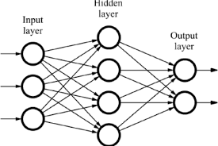
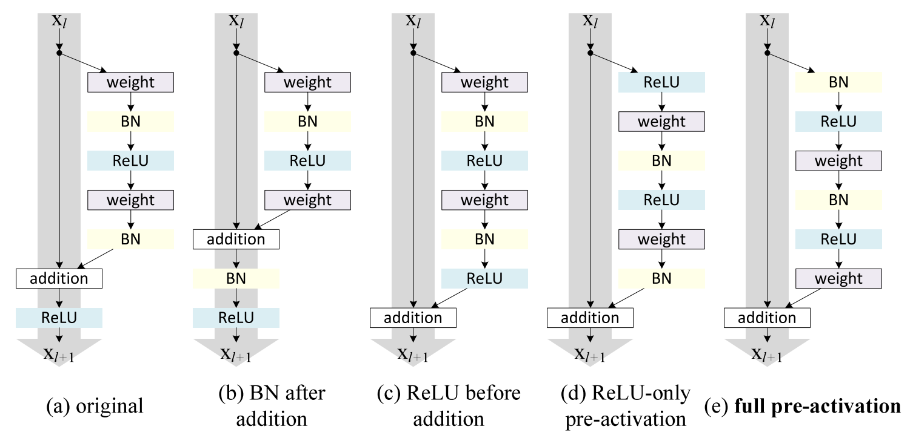
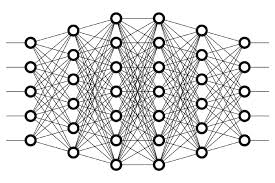

<h3 align="center">
</a> 
SCENER.io
</h3>

Customise Your CNN like never before

### Features

- UI that can run inference using the model trained unseen and unlabeled images uploaded at the same time.
- Models Can be deployed on any Cloud [ GCP,AWS,AZURE,DO]
- User Can change 15+ parameters of training

<h3> Models Used </h3>
 

### Installation

> This project is self Hosted project.You can host this project on your own servers. Installation steps will be provided soon.

### Challenges we ran into :

> Hosting project on the cloud using docker build was difficult beacuse we haven't done it before so we have to figure how to deploy model on cloud.

### Problem Statement
Create a platform for training, labeling and deploying and
retraining image classification models.
Following are the expected features to be deployed:
Dataset : [link](https://www.kaggle.com/puneet6060/intel-image-classification)
Train a model(s) that classifies images based on the
dataset provided.

Create a UI that can run inference using the model trained
above on 128 unseen and unlabeled images uploaded at
the same time.
Once inference is completed, the UI should then be able to
visualize these images and their predictions including the
confidence score and provide other metrics as appropriate.
The UI should have the functionality to change the labels of
images that are wrong, add them to a database and run
training again.
Optionally, the UI should have an option to change the
parameters of training. Parameters could be learning rate,
number of filters, filter size etc.
The newly trained model should be available for use by the
UI to run another round of inference

- Recognition : [DJCSI Codeshastra 6.0](https://djcsi-codeshastra.netlify.com)

